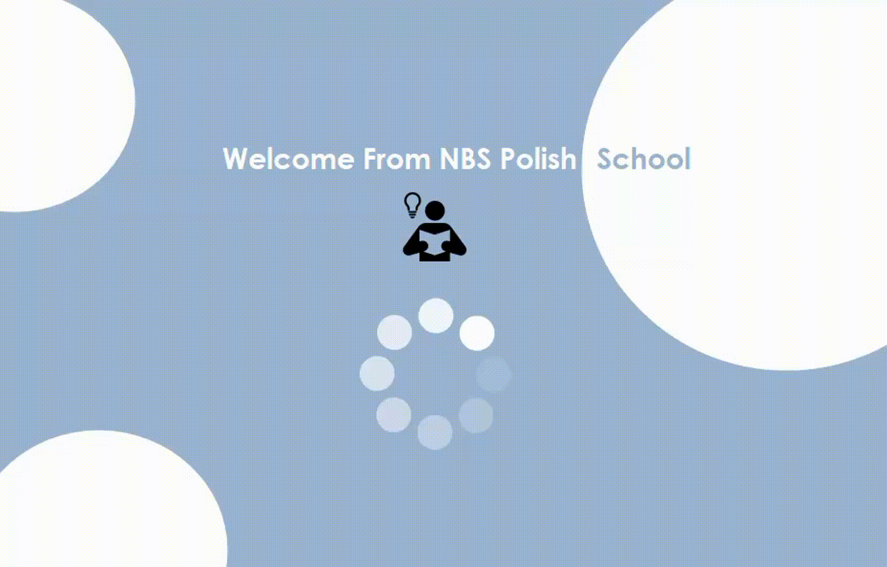

## System Zarządzania Studentami

Projekt został stworzony w celu nauki i doskonalenia umiejętności związanych z łączeniem aplikacji desktopowej z bazą danych. 

Główne cele to:

- **Nauka Integracji z Bazą Danych**
- **Praktyczne Zastosowanie Entity Framework**
- **Zarządzanie Bazą Danych**

### Kluczowe Funkcje

- **Zarządzanie Studentami**:
  - **Dodawanie**: Umożliwia dodawanie nowych studentów z pełnymi danymi takimi jak imię, nazwisko, numer identyfikacyjny, data urodzenia itp.
  - **Edytowanie**: Edytowanie szczegółów istniejących studentów.
  - **Usuwanie**: Możliwość usuwania studentów z systemu.
  - **Drukowanie**: Możliwość druku lub eksportu listy studentów do formatu PDF. 

- **Zarządzanie Kursami**:
  - **Dodawanie**: Możliwość dodawania nowych kursów z określonymi szczegółami, takimi jak nazwa kursu, kod kursu i opis.
  - **Edytowanie**: Edytowanie istniejących kursów.
  - **Usuwanie**: Usuwanie kursów, które nie są już potrzebne.
  - **Przypisywanie Kursów do Studentów**: Umożliwia przypisywanie kursów do studentów i śledzenie ich postępów.
  - **Drukowanie**: Możliwość druku lub eksportu listy kursów do formatu PDF. 

- **System Oceny i Raporty**:
  - **Oceny**: Wprowadzanie i aktualizowanie ocen studentów w ramach kursów.
  - **Drukowanie**: Możliwość druku lub eksportu listy ocen do formatu PDF. 

- **Interfejs Użytkownika**:
  - **Przyjazny Interfejs**: Intuicyjny i łatwy w obsłudze interfejs użytkownika zaprojektowany z myślą o efektywności i wygodzie pracy.

### Struktura Kodu

- **Formularze**: Zawierają interfejs użytkownika dla różnych funkcji, takich jak dodawanie, edytowanie i przeglądanie studentów oraz kursów.
- **Modele**: Klasy reprezentujące dane aplikacji, takie jak `StudentClass`, `CourseClass`, `ScoreClass`.
- **Baza Danych**: Używa lokalnej bazy danych (SQL Server) do przechowywania informacji o studentach, kursach i ocenach. Wykorzystuje Entity Framework do mapowania obiektów na bazę danych.

### Przykłądowe działanie aplikacji

#### Logowanie do systemu

#### Przykładowe zarządzanie studentami

#### Przykładowe zarządzanie kursami

#### Przykładowe zarządzanie ocenami
